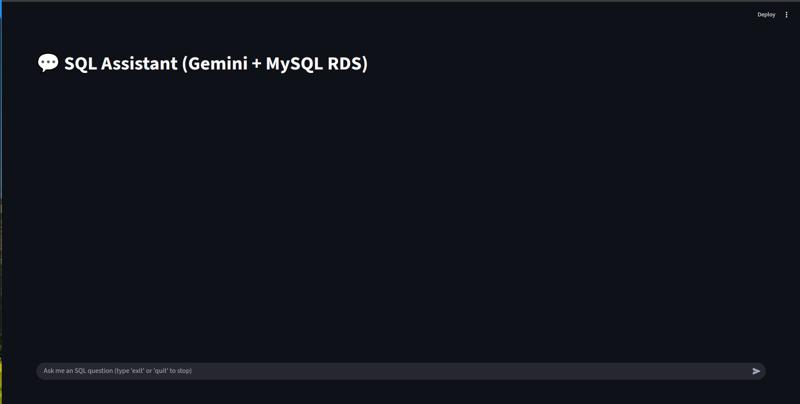
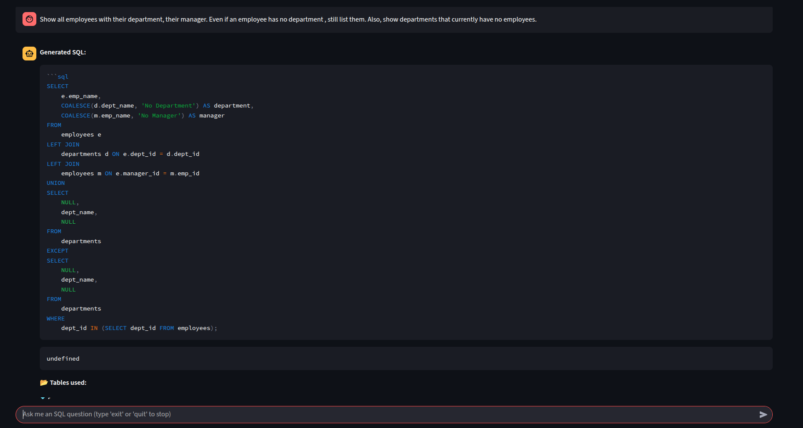
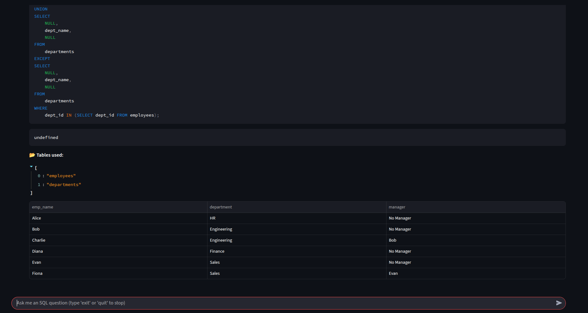
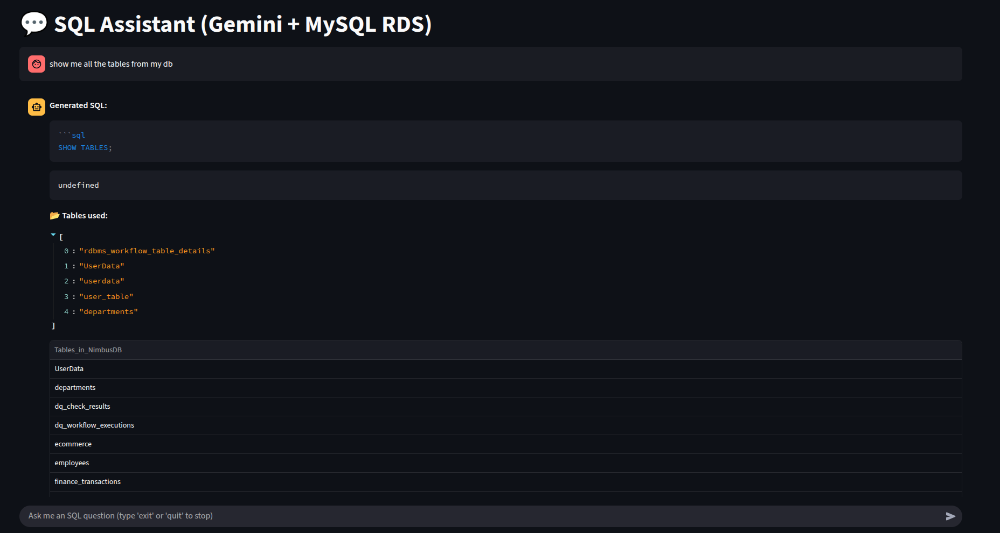
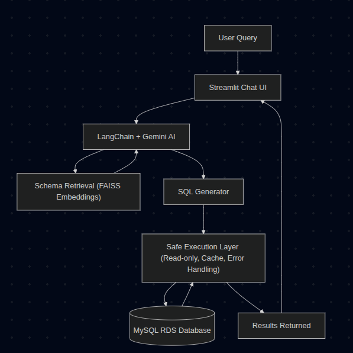

# 💬 SQL Assistant (Gemini + MySQL RDS)

A conversational **SQL Assistant** built with **Streamlit** that allows you to query your database using **plain English**.  
Powered by **Google Gemini** for SQL generation and **AWS MySQL RDS** for execution.  

---

## 🚀 Features
- 📝 **Natural Language → SQL** – Ask questions in English, get valid SQL instantly.  
- 🗂 **Schema Awareness** – Detects and shows which tables are being used.  
- 📊 **Interactive Results** – Clean, tabular output of query results in the app.  
- 💬 **Chat UI** – Conversation-style interface with `st.chat_input` & `st.chat_message`.  
- 🔄 **Session Memory** – Remembers your past queries and answers in the chat flow.  
- ⚡ **Safe Execution** – Enforces **read-only queries** and blocks destructive operations.  
- 📦 **Query Cache** – Stores past queries for faster retrieval and offline fallback.  

---

## 📸 Screenshots

### 🔍 Ask questions in plain English

### 📊 Auto-generated SQL & Results
  

### 🗂 Tables Used

---
## 🏗️ System Architecture

---

## 🛠️ Tech Stack
- [Streamlit](https://streamlit.io/) – UI framework
- [LangChain + Gemini](https://ai.google.dev/) – SQL generation
- [MySQL RDS](https://aws.amazon.com/rds/mysql/) – Database backend
- [SQLAlchemy](https://www.sqlalchemy.org/) – SQL execution layer

---

## ⚙️ Contact
- [Linkedin](https://www.linkedin.com/in/naman-bansal06/)
- [Gmail](bansalnaman44@gmail.com)
